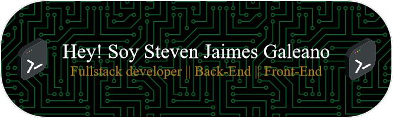
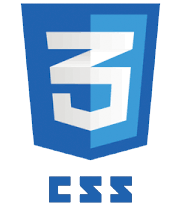
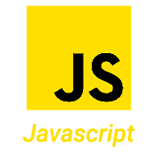
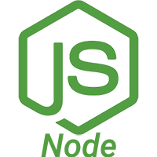
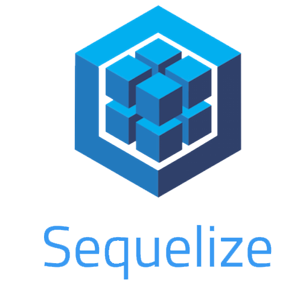
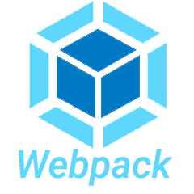
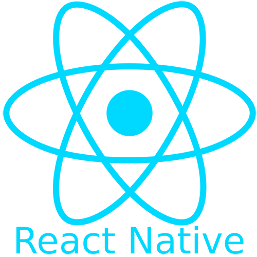
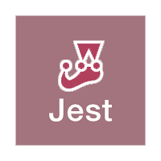

<div align="center">
    
</div>

<h1 align="center">Hi 👋,Soy Steven Jaimes Galeano</h1>
<h3 align="center">A passionate FullStack Developer from Colombia</h3>

<p align="justify">I finished Henry Bootcamp and along with it, I learned a lot about web development. Now I am looking for an opportunity to continue a career in
this field. I'm looking towards a future as a developer, and to pursue this path I will for sure learn more about many other technologies and develop other projects by myself. I am glad that you visited my profile. Welcome.</p>

### - A little about me 🤔
```javascript
const ryudark = {
    pronouns: "He" | "Him",
    code: ["Javascript"],
    askMeAbout: ["web dev", "tech", "anime", "videogames"],
    technologies: {
        frontEnd: {
            js: ["React" , "Redux"],
        },
        backEnd: {
            js: ["Node" , "Express"],
        },
        databases: {
            sql: ["Sequalize" , "PosgreSql"],
        },
        mobile: {
            js: ["React Native"],
        },
        tools: ["Terminal", "Visual Studio Code","Github"]
    },
    techCommunities: {
                        student: ["Henry", "No country"],
                        employee: "Logistecsa",
                        colaborator: "League of Extraordinary FoundryVTT Developers"
    },
    currentProject: "I`m improving my developing skills"
};
```

<h3 align="left">Languages and Tools:</h3>
<div style="display:flex;">












</div>

<br/>

<h3 align="left">Connect with me:</h3>
<p align="center">
<a href="https://www.linkedin.com/in/steven-jaimes-galeano/" target="blank"></a>
<a href="https://www.facebook.com/suteben/" target="blank"></a>
<a href="https://www.instagram.com/steven_jaimes_galeano/" target="blank"></a>
<a href="https://github.com/Ryudark" target="blank"></a>
</p>

<p> But also you can reach me: at steinu037@gmail.com</p>

<br/>
<p align="center"></p>
<br/>
